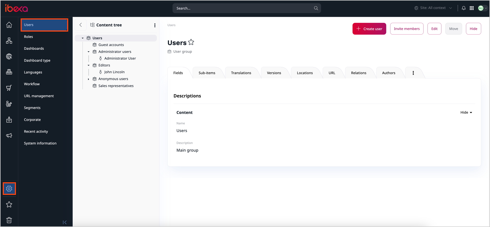
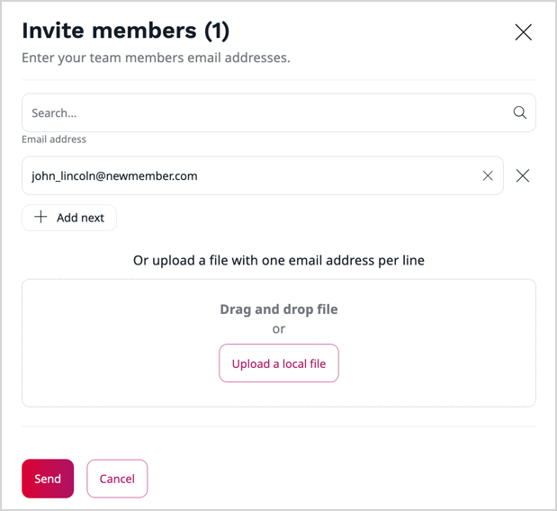

# Manage users

Users in [[= product_name =]] are treated the same way as other Content items.
They are organized in groups, which helps you manage them and their permissions.

You can view all User Groups and Users in the **Admin Panel** by selecting **Users**.
Here, you can manage users, their relations, Roles and Policies.
As you can see, the interface is the same as when working with regular Content items.

!!! caution

    Be careful not to delete an existing User account.
    If you do this, content created by this User will be broken and the application can face malfunction.

## Register as a user

In most cases it is the administrator who invites users to log into the application.
You can still access the registration form for the website by adding `/register` 
to the address, for example: `www.my-site.com/register`. 
By default, new Users created in this way are placed in the Guest accounts group.

## Invite users

To invite users, go to **Admin** -> **Users** and click **Invite members** in the top right corner.

To send invitations, fill out email addresses one by one,
or use drag and drop to upload a file with an email list, then click **Send**.

Invited users will receive an email message with a registration link.
With it, they can register and create their account
in the frontend as customers or in the Back Office as members of the team.
