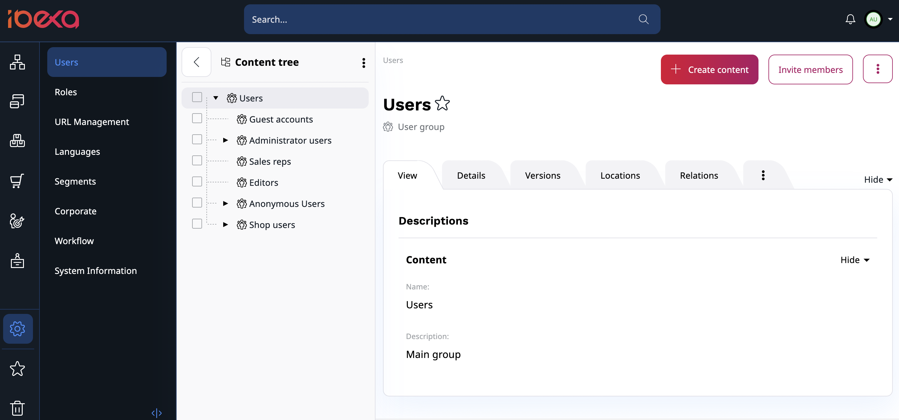

# User management

You can find the **Users** section in the Admin panel of the Back Office.
There, you can manage users, their relations, roles and policies.

## Inviting Users

To invite users, go to **Admin** -> **Users** and click **Invite members** in the top right corner.

To send invitations fill out email addresses one by one,
or use a drag and drop to upload a file with an email list and click **Send**.

Users will receive an email message with a registration link.
With it, they can register and create their account
in the frontend as customers or in the Back Office as members of the team.
