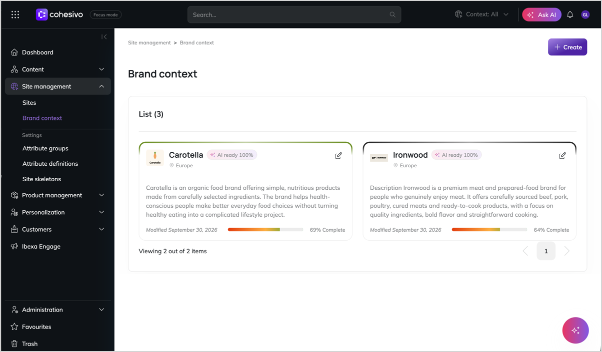

# Brand context

Brand contexts provide business-level information that helps marketers, brand managers, and external systems such as AI integrations understand your websites and work with them.

A brand context describes what a website represents from a business perspective.
It can include information about the brand, target region or market, communication channels, visual identity, and brand-specific guidelines.

This information helps editors [create content](../content_management/content_management.md#create-and-edit-content) that aligns with the brand and provides external systems with the context they need to work with your websites.

For more information about creating and managing brand contexts, see [Work with brand contexts](work_with_brand_contexts.md).

!!! note "Accessing brand context list"

    You can only view and edit brand contexts if you have the right permissions.

## Brand context and multiple websites

If your brand operates [several websites](multisite.md), for example, for different countries, languages, or audiences, you can use a brand context to group related websites.
The brand context helps you identify the group to which the selected website belongs.

For example, a food producer might have the following websites:

- **Carotella** - for individual customers
- **Carotella Pro** - for professional kitchens
- **Carotella Trade** - for distributors, retailers and food processors

All three websites belong to the same brand context but use their specific language, content, and presentation.

!!! note ""One-to-many" limitation"

    You can have multiple brand contexts within one installation to support multiple brands, but one website can be assigned to only one brand context.

When you have multiple brand contexts with websites assigned to them, you can use the site selector in the top right corner of the screen to display these websites grouped by their brand context.
These websites share brand metadata, guidelines, and visual identity information, but when you select a website from the switcher, multiple back office elements change based on [SiteAccess configuration](multisite.md#siteaccess), for example:

- [Content tree](discover_ui.md#content-tree) filters to show only that site's content
- [Preview](preview_content_items.md) renders using that site's templates and design
- [Available languages](translate_content.md#website-languages) change to what that site supports
- [Search and filtering](search_for_content.md) scope narrows to that site's content

## Attributes and attribute groups

A brand context contains the following basic information:

- a name, identifier, and description
- a logo and a primary brand color
- a market or region of operation

However, you may want to record additional information to help team members understand the purpose and identity of the brand.
An individual piece of such information is called an "attribute".
Logical categories that bring related pieces of information together are called "attribute groups".

!!! tip "Organize information with attribute groups"

    While you could put all attributes in one category, it's recommended that you use logical attribute groups.
    This helps keep the editing screen organized, especially when a brand context contains a large amount of information.

By default, [[= product_name =]] comes with the following attribute groups:

- **Brand identity** - Brand name, tagline, logo, color palette, tone of voice, and core values
- **Market information** - Region, target markets, primary currency, legal entity, and compliance notes
- **Channel attributes** - Channel type, social handles, contact information, and support URLs
- **AI/integration attributes** - Content style guide, generation constraints, persona definition, and forbidden topics

You can define custom attributes and their categories that are tailored to your organization's needs.

For more information about managing attributes, see [Work with brand context attributes](work_with_brand_context_attributes.md).
