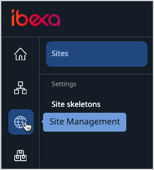

# Work with sites

If multisite support is enabled for your instance of [[= product_name =]], you can 
use Site Factory to create and manage multiple sites from one place.
These websites can, for example, be in different languages, or customised for 
different audiences, and still be kept in the Repository of your installation.
To be able to use it, the Site Factory has to be enabled and configured by the administrator.
For more information see developer documentation on [Site Factory]([[= developer_doc =]]/multisite/site_factory/site_factory).

## Create a site

To access Site Factory, in the leftmost pane, click the **Site** icon and then **List**.
If Site Factory is enabled, and you have sufficient permissions, you should see 
the **Create** button. Click it to access the **Creating New Site** modal.

Here, you can create an entirely new site or a different language version of an already existing site.
First, you select a name, a predefined design, and a Parent Location for your site.

If the design defines a Site skeleton, you can choose if you want to copy the entire content structure of the design with a toggle.
To preview the Site skeleton architecture, click **Site**, and then **Site skeletons**.

Next, you can decide if the site will go live after creation or will be offline with the Status switcher.
In this section you also define the SiteAccess URL addresses with their main languages, fallback languages, and optional paths for the site.

!!! note "Path limitation"

    The path can be only one directory deep. 
    Do not use paths that have more than one element, for example, `/en/articles`.

For more information about SiteAccesses, see [Multisite]([[= developer_doc =]]/multisite/multisite/).

If all required fields are filled out you can select **Create,** and the site will be added to the site list in the **Site** tab.

!!! note

    A SiteAccess that you create in Site Factory is always treated with lower priority 
    than a SiteAccess defined by the administrator as part of [configuration]([[= developer_doc =]]/multisite/multisite_configuration/#siteaccess-configuration). 
    For example, if you create a site that uses the `fr` path in Site Factory, and the administrator 
    defines a French site manually in configuration files, your site is ignored by the system.

## Preview a site

To preview the site, select the **Location preview** icon (the eye icon) that is situated next to the site name.
It will transfer you to Page Builder site preview.

## Edit an existing site

To edit the site select **Site settings** icon that is situated next to the site name.
Here, you can edit all the elements you selected during creation of the site:

- name
- design
- visibility
- URL
- language

## Delete an existing site

To enable deleting a site you have to change the site status to offline.
Live sites cannot be deleted. Next, select the **Delete** icon and confirm your choice.

