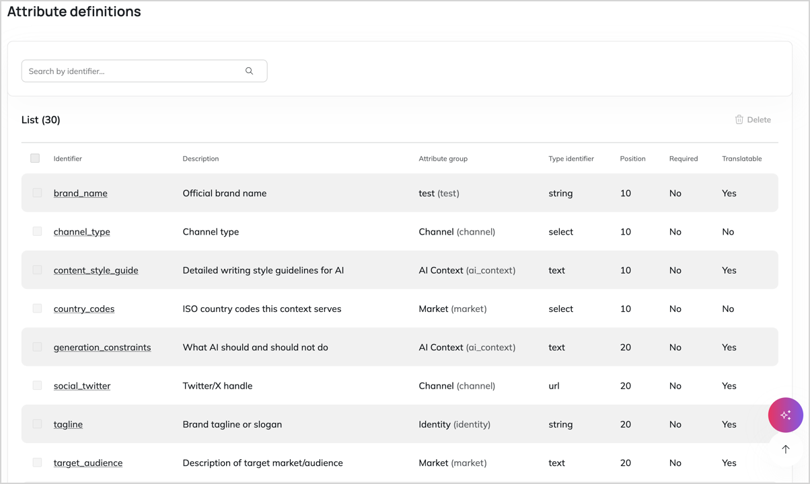
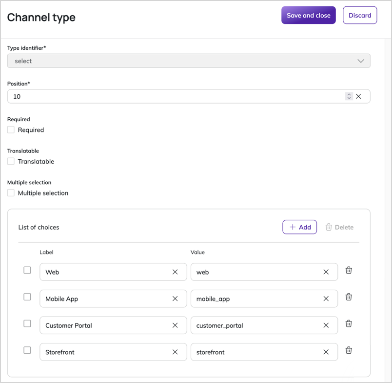

# Work with brand context attributes

Attributes let you store additional brand-specific information in a [brand context](brand_context.md).
Attribute groups help keep the brand context editing screen organized, especially when a brand context contains a large amount of information.

By default, [[= product_name =]] comes with a multiple predefined [attributes and attribute groups](brand_context.md#attributes-and-attribute-groups), but you can define custom ones that suit your organization's needs.

To work with brand contexts, you need the appropriate [permissions](../permission_management/permission_system.md).

## Manage attribute groups

Manage attribute groups that you use to assign attributes to. 

### Create an attribute group

1. In the left panel, go to **Site Management** -> **Attribute groups** and click **+ Create**.
1. In the attribute group editing screen, provide the following information:
    - **Language** - a base language for the attribute group
    - **Label** - a human-readable name for the attribute group
    - **Identifier** - a unique identifier used by the system

1. Click **Save and close** to create the attribute group.

The attribute group is now available when you edit or create attributes, and will appear on brand context editing screens.

### Edit existing attribute group

1. In the left panel, go to **Site Management** -> **Attribute groups**.
1. Click the name of the attribute group that you want to edit.
1. In the attribute group editing screen, click **Edit**.
1. Modify the fields as needed and click **Save and close** to save your changes.

### Translate an attribute group

You can translate the name of an attribute group to additional languages.

1. In the attribute group details screen, go to the **Translations** tab.
1. Click **+ Add**, select the base and target languages, and click **Create**.
1. In the editing screen, replace the label in the source language with a translation.
1. Click **Save and close** to save the translation.

### Delete an attribute group

You can delete an attribute group only when it doesn't contain any attributes.

1. In the left panel, go to **Site Management** -> **Attribute groups**.
1. Click the name of the attribute group that you want to delete.
1. In the attribute group editing screen, click **Delete**.
1. In the confirmation modal, click **Delete**.

## Manage attributes

Manage attributes that store specific pieces of information about a brand context.

### Create an attribute

1. In the left panel, go to **Site Management** -> **Attribute definitions** and click **+ Create**.
1. Select the language and the type for the attribute and click **Create**.
     Available attribute types are:
     - **Integer** - whole numbers
     - **String** - text of less than 255 characters
     - **Text** - single-line text input
     - **Rich text** - multi-line text with formatting
     - **String** - text of less than 255 characters
     - **Selection** - a list of options to choose from
     - **URL** - a URL address
     - **Email** - an email address
     - **Color** - a color selection in hexadecimal format
     - **Content** - a content selector that opens a content browser
     - **Structure** - nested data in JSON format, for storing any hierarchical data without a database structure
1. In the brand context attribute editing screen, provide the following information:
    - **Description** - a brief description of what this attribute is for
    - **Identifier** - a unique identifier used by the system
    - **Attribute group** - the group to which this attribute belongs
    - **Position** - a place in which this attribute appears within its group
    - **Required** - a check box that decides if this attribute must be populated in every brand context
    - **Translatable** - a check box that decides if this a value of this attribute value can be translated to different languages

1. If you selected **Selection** as the attribute type, define the available options:
    1. Select **Multiple selection** to allow users to select multiple options from the list
    1. In the **List of choices** section, click **+ Add**
    1. Enter the option label and value

1. Click **Save and close** to create the attribute.

The newly created attribute is now available on brand context editing screens within its assigned attribute group.

### Edit an attribute

1. In the left panel, go to **Site Management** -> **Attribute definitions**.
1. Click the name of the brand context attribute that you want to edit.
1. Click **Edit** and, in the brand context attribute editing screen, modify the fields or options as needed.
1. Click **Save and close** to save your changes.

### Translate an attribute

Brand context attribute definitions can be translated to additional languages.

1. On the attribute details screen, go to the **Translations** tab.
1. Click **+ Add**, select the base and target languages, and click **Create**.
1. In the editing screen, replace the source text with translations, including selection options, where necessary.
1. Click **Save and close** to save the translation.

### Delete an attribute

!!! caution "Risk of data loss"

    When you delete a brand context attribute definition, any values that were entered for that attribute in brand contexts are also deleted.

1. In the left panel, go to **Site Management** -> **Attribute definitions**.
1. Click the name of the brand context attribute that you want to edit.
1. In the details screen, click **Delete**.
1. In the confirmation modal, click **Delete** to confirm.

The attribute is deleted from the system and from all brand contexts.
