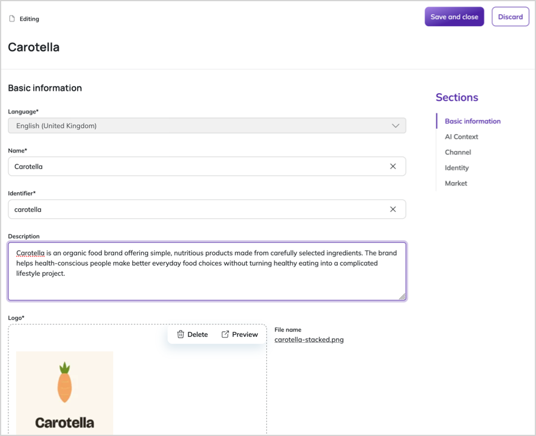
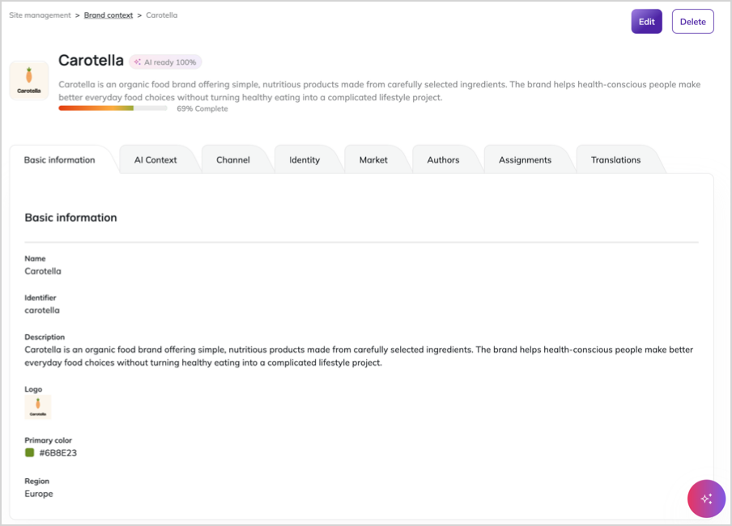
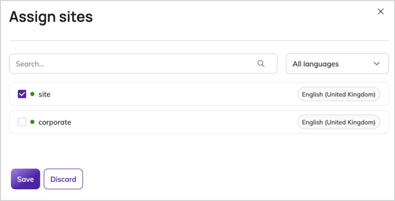

# Work with brand contexts

You can create and manage [brand contexts](brand_context.md) to organize related websites and store business-level information that describes what a website or group of websites represents, such as brand identity, market positioning, and content guidelines.

To work with brand contexts, you need the appropriate [permissions](../permission_management/permission_system.md).

## Create new brand context

You can create as many brand contexts as you need to support your organization's brands, regions, or markets.

1. In the left panel, go to **Site Management** -> **Brand context** and click **+ Create**.
1. Select a language and click **Create**.
1. In the brand context editing screen, provide the following basic information:

    - **Name** - a human-readable name for the brand context
    - **Identifier** - a unique identifier used by the system. It's automatically generated, but you can change it
    - **Description** - a brief description of the brand context
    - **Logo** - an image uploaded or selected from the media library to represent the brand
    - **Color** - a primary brand color in hexadecimal format
    - **Region** - a market or region of operation

4\. In the sections below the basic information, populate the [attributes](brand_context.md#attributes-and-attribute-groups) relevant to your brand context.

5\. Click **Save and close** to create the brand context.

The newly created brand context appears in the brand context list with a [completeness indicator](#brand-context-completeness) that shows how many of the available fields have been filled in.

## Edit existing brand context

You can review and edit all aspects of a brand context, including its basic information and attributes.

1. In the left panel, go to **Site Management** -> **Brand context**.
1. Click the name of the brand context that you want to edit.
1. In the brand context details screen, click each of the tabs to review its information.
1. Click **Edit** and, in the brand context editing screen, modify the basic information or attributes.
1. Click **Save and close** to save your changes.

### Assign websites to brand context

Each website can be assigned to only one brand context.
If a website is already assigned to another brand context, you must first remove it from that context before assigning it to a new one.

1. In the brand context details screen, go to the **Assignments** tab.
1. Click **Assign sites**.
1. In the **Assign sites** modal, select checkboxes next to the websites that you want to assign to this brand context.
1. Click **Save**.

!!! note "Common content tree root"

    Websites that you assign to the same brand context must share the same content tree root.
    The system validates this when you assign websites.
    
### Translate brand context

Similarly to other content items, brand contexts can be translated to additional languages.

1. In the brand context details screen, go to the **Translations** tab.
1. Click **+ Add**, select the base and target languages, and click **Create**.
1. In the brand context editing screen, replace the source text with translations.
1. Click **Save and close** to save the translation.

## Delete brand context

!!! caution "Risk of data loss"

    If the brand context contains elaborate attributes such as tone of voice, content style guide, or AI-assisted content generation constraints, deleting the brand context removes this information.

If the brand context has websites assigned to it, the websites remain in the system but are no longer assigned to any brand context.

1. In the left panel, go to **Site Management** -> **Brand context**.
1. Click the name of the brand context that you want to delete.
1. In the brand context details screen, click **Delete**.
1. In the confirmation modal, review the websites assigned to the brand context.
1. Click **Delete** to confirm.

The brand context is removed, and any assigned websites are unassigned.

## Brand context completeness

Brand context completeness shows how many of the available fields have been filled in.
It helps you identify which parts of the brand context still need attention.

The completeness indicator appears as a progress bar on each brand context's tile in the list, and on the brand context details screen.

Completeness is a guidance tool.
You can still use a brand context even when some fields are empty.
