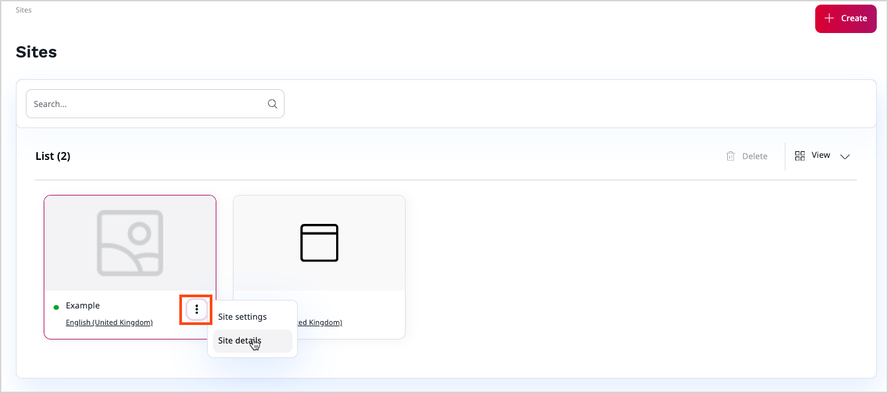

# Work with websites

If multisite support is enabled for your instance of [[= product_name =]], you can 
use Site Factory to create and manage multiple websites from one place.
These websites can, for example, be in different languages, or customized for 
different audiences, and still be kept in the Repository of your installation.
To be able to use it, the Site Factory has to be enabled and configured by the administrator.
For more information, see developer documentation on [Site Factory]([[= developer_doc =]]/multisite/site_factory/site_factory).

## Create a website

To access Site Factory, in the left panel, click the **Site Management** icon and then **Sites**.
If Site Factory is enabled, and you have sufficient permissions, you should see 
the **Create** button. Click it to access the **Creating New Site** modal.

Here, you can create an entirely new website or a different language version of 
an already existing website.
First, select a name, a predefined design, and a Parent Location for your website.

If the design defines a Site skeleton, you can choose if you want to copy the entire content structure of the design with a toggle.
To preview the Site skeleton architecture, click **Site management**, and then **Site skeletons**.

Next, you can decide if the website will go live after creation or will be offline with the Status switcher.
In this section you also define the SiteAccess URL addresses with their main languages, fallback languages, and optional paths for the website.

!!! note "Path limitation"

    The path can be only one directory deep. 
    Do not use paths that have more than one element, for example, `/en/articles`.

For more information about SiteAccesses, see [Multisite]([[= developer_doc =]]/multisite/multisite/).

If all required fields are filled out, click **Save and close** to create new website and add it to the website list in the **Site management** area.

!!! note

    A SiteAccess that you create in Site Factory is always treated with lower priority 
    than a SiteAccess defined by the administrator as part of [configuration]([[= developer_doc =]]/multisite/multisite_configuration/#siteaccess-configuration). 
    For example, if you create a website that uses the `fr` path in Site Factory, and the administrator 
    defines a French website manually in configuration files, your website is ignored by the system.

You can see all the details of created website.
To do it, go to **Site management** -> **Sites** and click the three dots icon next to the website name. Then, select **Site details**.

## Edit an existing website

To edit the website, click the three dots icon that is situated next to the website name, and select **Site settings**.
Here, you can edit all the elements you selected during creation of the website:

- name
- design
- visibility
- URL
- language

## Delete an existing website

To enable deleting a website you have to change the website status to offline.
Live websites cannot be deleted. Next, select the **Delete** icon and confirm your choice.

