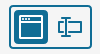
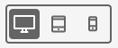
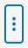
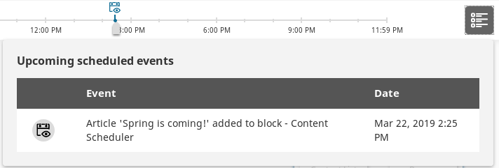

!!! enterprise

    # Working with a Page
    
    **Page** is a special Content Type that contains zones onto which you can drop different dynamic blocks.
    You create and edit Pages using the Page Builder accessible in the Back Office by clicking **Page**
    and selecting the page to edit from the toolbar that appears below.
    You can create a Content item here by clicking the plus button in the upper-right corner.
    
    !!! tip
        The Page Content Type contains a **Landing Page** Field Type which manages the zones and blocks.
        Any Content item that has the **Landing Page** Field Type will behave like the Page Content Type.
    
    ## Getting started
    
    The Page Builder comes with a toolbar that enables you to perform advanced editing and previewing of the Page.
    
    
    
    Using the toolbar buttons, you can perform the following actions:
    
    |Button|Description|
    |------|-----------|
    ||Switch between previewing and editing the Page.|
    ||Switch between viewing the Page contents and the Page title and description.|
    ||Toggle through to see how the Page is rendered on different devices.|
    ||Access the timeline to preview the Page changes depending on the date or view the list of all upcoming scheduled events. For details, see [Timeline](publishing/advanced_publishing_options.md#timeline).|
    ||Access menu enabling you to switch layout, see versions of the Page, manage translations, or delete the Page.|
    
    In a newly created Page you must first choose a layout which defines the available zones.
    You can switch it later by using the following menu:
    
    
    
    Applying a layout divides the Page into those zones that are place holders for the contents of the Page.
    Now you are ready to add blocks of content to the Page.
    
    ## Adding blocks
    
    In the editor you can access a menu of Elements — a set of blocks of content that you can add to the zones of the Page.
    Each block is unique in its function and enables you to personalize the content appearing on the Page.
    
    
    
    Add a block by dragging it from the menu to an empty place on a zone.
    Do not worry about placing blocks in the proper place from the start.
    You can reorder them at any time by dragging and dropping them in the desired location.
    
    eZ Enterprise comes with a set of ready-to-use Page blocks,
    but [developers can add their own](https://doc.ezplatform.com/en/latest/guide/page_rendering/#page-blocks/).
    
    
    
    The blocks provided with a clean installation of eZ Enterprise are:
    
    |Block|Description|
    |-----|-----------|
    |Form|Embeds a Form Content item that you select from the Content Structure.|
    |Code|Enables you to place content (text, links, images, etc.) on your Page using custom HTML.|
    |Content List|Displays Content items of a chosen Content Type (or Types) that are contained in a selected folder.|
    |Banner|Displays an image Content item with a URL attached to it.|
    |Collection|Displays a set of Content items you select manually from the Content structure.|
    |Embed|Embeds a Content item of any Content Type on the Page.|
    |Gallery|Displays all images contained in a selected folder.|
    |Video|Embeds a video into the Page with standard playback controls.|
    |RSS|Loads and displays news from RSS feeds (channels).|
    |Content Scheduler|Displays Content items at a pre-define time. Ideal for automatic updates of the Page content|
    |Text|Enables you to place on the Page a block containing Rich Text.|
    
    ## Blocks of content — adjusting general settings
    
    Each kind of blocks has its special properties. 
    You can access them by, after dropping a block on the Page, placing the cursor on it and clicking the cog button.
    Use the same menu to remove the block from the Page by clicking the trash button.
    
    
    
    Settings available for blocks are divided into three tabs — **Basic**, **Design**, and **Scheduler**.
    The settings available in the **Basic** tab are tailored to the content a block is designed to display.
    The remaining tabs contain parameters common to all blocks provided with eZ Enterprise. 
    Use them to modify the layout and visibility of a block.
    Always ensure that you set all the required settings of a block of content to successfully publish the Page.
        
    In the **Design** tab, perform the following actions:
    
    - From the **View** list, select the block layout.
    - *Optional:* In the **Class** box, define the class of the block
    - *Optional:* In the **Style** box, add additional style formatting.
    
    In the **Scheduler** tab, define the visibility time of the block by performing the following actions:
    
    - In the **Reveal** section, set the visibility to **Now** or plan it for future publish by clicking **Set date** and setting the date.
    - In the **Hide** section, disable the option to hide the block by selecting **Never** or 
    plan to hide it in future by clicking **Set date** and setting the date.
    
    !!! tip
        Settings and function of custom-made blocks of content depend on their design. 
        For details on adjusting and using them, contact your website administrator.
    
    ### Form block — adjusting settings
    
    Note that completing the settings of the Form block requires at least one Form Content item created.
    
    In the **Basic** tab, perform the following actions:
    
    - In the **Name** box, provide the name of the block that will appear on the Page.
    - In the Form section, click **Select content**, navigate through the content and select a Form Content item to append it to the block.
    
    Click **Submit** to save the changes or **Discard** to cancel.
    
    ### Code block — adjusting settings 
    
    In the **Basic** tab, perform the following actions:
    
    - In the **Name** box, provide the name of the block that will appear on the Page.
    - In the **Content** box, enter the HTML code for the content you want to display on the Page.
    You can start with the part of the code that generally belongs to the `body` block.
    
    Click **Submit** to save the changes or **Discard** to cancel.
    
    ### Content List block — adjusting settings
    
    In the **Basic** tab, perform the following actions:
    
    - In the **Name** box, provide the name of the block that will appear on the Page.
    - In the **Parent** section, click **Select content**, navigate through the content and select a folder containing Content items
    to display on the list. Click **Confirm**.
    - In the **Limit** section, enter a number or use the up and down buttons to set the limit of Content items to display.
    - From the **Content Types to be displayed** list, select Content Type(s) to be displayed.
    The block will display Content items of the selected Content Types that are in the selected parent folder.
    
    Click **Submit** to save the changes or **Discard** to cancel.
    
    ### Banner block — adjusting settings
    
    In the **Basic** tab, perform the following actions:
    
    - In the **Name** box, provide the name of the block that will appear on the Page.
    - In the **Image** section, click **Select content**, navigate through the content and select an image to display.
    - In the **URL** box, enter a URL to open when clicking the selected image.
    
    Click **Submit** to save the changes or **Discard** to cancel.
    
    ### Collection block — adjusting settings
    
    In the **Basic** tab, perform the following actions:
    
    - In the **Name** box, provide the name of the block that will appear on the Page.
    - In the **Location list** section, click **Select Content**, navigate through the content 
    and add to the collection Content items of any Content Type you want.
    All selected Content items appear in the **Confirmed items** box at the bottom of the window.
    When done selecting, click **Confirm**.
    
    Click **Submit** to save the changes or **Discard** to cancel.
    
    ### Gallery block — adjusting settings
    
    In the **Basic** tab, perform the following actions:
    
    - In the **Name** box, provide the name of the block that will appear on the Page.
    - In the **Folder** section, click **Select content**, navigate through the content, select a folder containing images to display and click **Confirm**. 
    After submitting the settings, all images in the folder will appear in the Gallery block. 
    Note that selecting a folder containing Content items other than images results in displaying only a link to the folder they are stored in.
    
    Click **Submit** to save the changes or **Discard** to cancel.
    
    ### Video block — adjusting settings
    
    In the **Basic** tab, perform the following actions:
    
    - In the **Name** box, provide the name of the block that will appear on the Page.
    - In the **Video** section, click **Select content**, navigate through the content, select a video to display in the block and click **Confirm**.
    In the **Basic** tab you can preview the selected video before adding it to the Page.
    
    Click **Submit** to save the changes or **Discard** to cancel.
    
    ### RSS block — adjusting settings
    
    In the **Basic** tab, perform the following actions:
    
    - In the **Name** box, provide the name of the block that will appear on the Page.
    - In the **URL** box, provide the URL for the RSS news feed.
    - In the **Limit** box, enter a number or use the up and down buttons to set the limit of news items appearing in the block.
    - In the **Offset** box, enter a number or use the up and down buttons to set the limit of featured news items appearing in the block.
    
    ### Content Scheduler block — adjusting settings
    
    In the **Basic** tab, perform the following actions:
    
    - In the **Name** box, provide the name of the block that will appear on the Page.
    - In the **Limit** box, enter a number or use the up and down buttons to set the limit of Content items appearing in the block.
    - In the **Select content item(s)** section, click **Select Content**, navigate through the content and select Content items to display.
    When done selecting, click **Confirm**.
    In the **Content airtime settings** window, set the date and time for displaying the Content items.
    Click **Submit** to set the date. 
    
    At this point, the **Basic** tab displays the **Now showing** section listing Content items visible immediately after submitting the changes
    and **Queue** for Content items set for future publication. 
    You can change the date and time for publishing a Content item by clicking the antenna icon or
    delete a Content item from the list by clicking the trash icon.
    
    When done adjusting all settings, click **Submit** to save the changes or **Discard** to cancel.
    
    !!! tip
        Access the timeline from the top toolbar to preview the scheduled publications or
        click the button appearing to the right of the timeline to see all upcoming scheduled events.
        Note that editing the Page is possible only when the preview is set to the current date and time.
    
    
    
    ### Text block — adjusting settings
    
    In the **Basic** tab, perform the following actions:
    
    - In the **Name** box, provide the name of the block that will appear on the Page.
    - In the **Content** box, enter text, images, videos, etc. using the Online Editor. 
    For details, see [Editing Rich Text Fields](creating_content_basic.md#editing-rich-text-fields).
    
    When done editing, click **Submit** to save the changes or **Discard** to cancel.
    
    ## Publishing the Page
    
    If you are ready to publish the Page, in the menu, click **Publish**.
    To save it as a draft to finish editing it later, click **Save**.